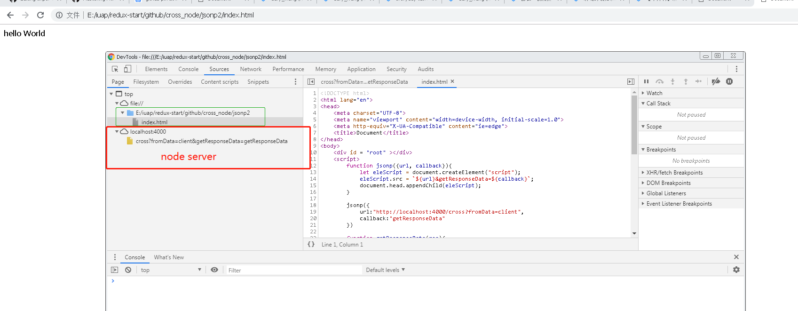

#通过本地搭建NODE环境，手动实现JSONP的的跨域处理.
### 跨域出现的原因：浏览器的同源安全策略。按照MDN所说，同源策略限制了从同一个源加载的文档或者脚本如何和来自另一个源的文档和脚本等资源进行交互，这是阻止恶意文件程序攻击的一个重要安全机制。
### 同源就是协议(http\https),域名（www.taobao.com）和端口号（80，8080）都相同，这才称之为同源，与之相对的皆是不同源，是跨域的范围了。
#### 实现原理:采用的是是html的script标签src属性不受同源限制

## Quickstart

- From github
```
git clone ....
```
```
npm run start
```
#### 成功后的效果图

